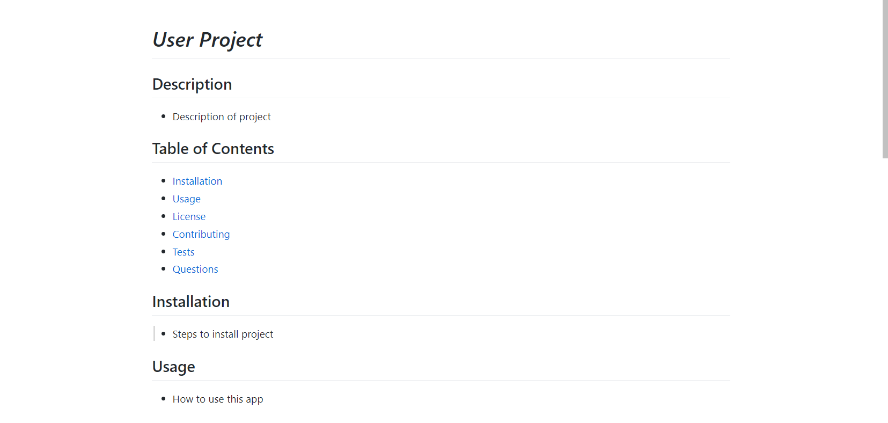
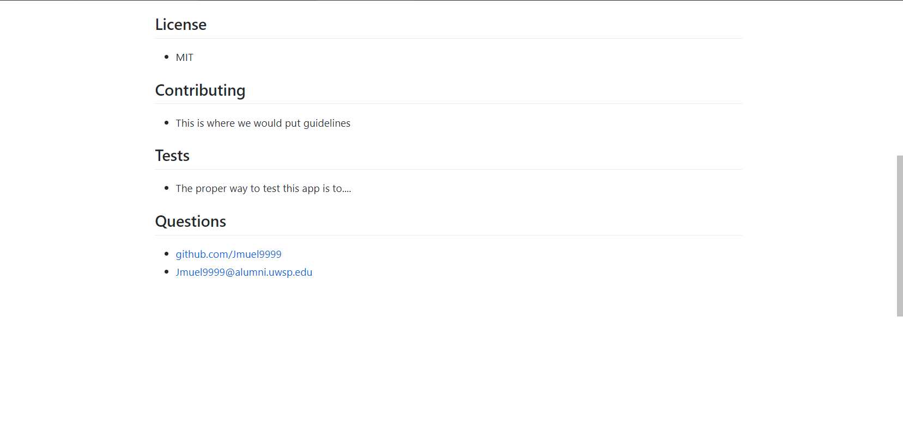

# challenge9 -- Professional-README-Generator

## Purpose
The purpose of this project is to take user input and generate a professional README.md file from the given information.

## Build with
* Node.js
* JavaScript

## Assignment Video Walkthrough
https://drive.google.com/file/d/1icsPqJQq1ss4qj1cu55hdIbggwmEzzFh/view

## Screenshot of generated README.md file

